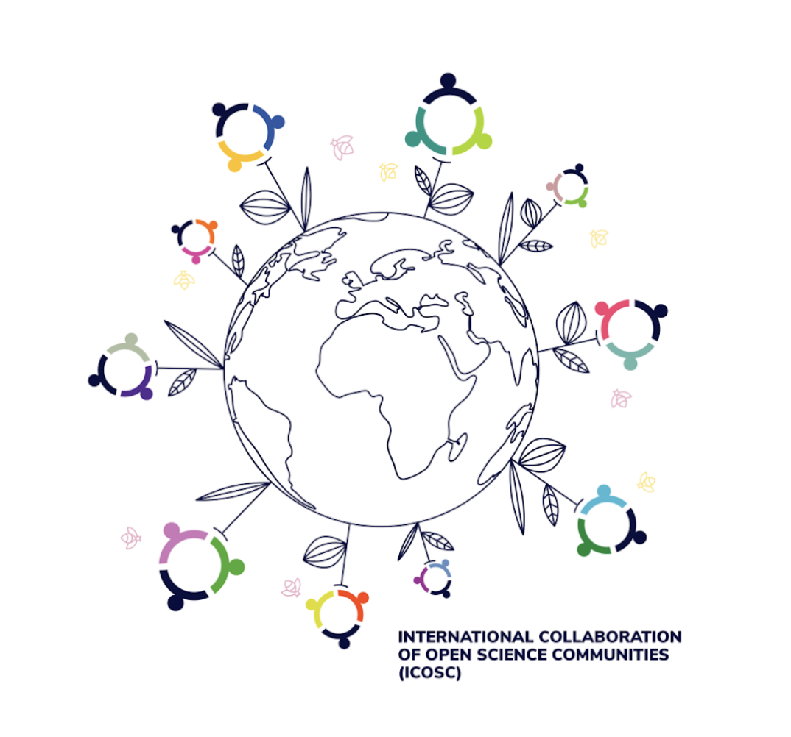

```{r setup, include=FALSE}
options(htmltools.dir.version = FALSE)
```

class: inverse, center, middle

## The What

---
class: center, middle

.left-column[
<h3>The What</h3>


<h3><alpha>The How</alpha></h3>

<h3>The When</h3>
</alpha>

]

## Open science

--

**Accessible**

--

**Reproducible**

--

**Freely available**

---
class: middle

.left-column[
### The What

.faded[
### The How

### The When
]

]


An important goal is to practice science in a transparent way. 

Open science topics include: 

- transparent methods
- pre-registration
- sharing data/code and research tools
- reproducibility
- replication research
- citizen science
- open peer-review
- publishing <oa>open access</oa> `r emo::ji("unlock")`
- diversity and inclusion
- research integrity
- uploading preprints and (meta) research about scientific methods

---
class: inverse, center, middle

## The How

---
class: center, middle

Embarking on Open Science can seem rather daunting at first: there are so many new terms and all sorts of different organisations committed to Open Science. 

The <b>Open Science Community Leiden</b> wants to make the new developments accessible to everyone, in an efficient manner. 

Start small and ask your colleague further down the corridor how he or she experienced something? To find that colleague, just take a look at the member profiles of the <b>Open Science Community Leiden</b>. 

We will organise events such as workshops or talks, including drinks, so you can get to know each other and find out who to ask. 

With experiences harvested at these events, we actively inform top down policy makers, to ensure we co-create the open future together. 

---
class: inverse, center, middle

## The When

---
class: center, middle

OSCL events can be accessed through the [OSCL Teams](https://teams.microsoft.com/l/team/19%3a38da1fd582434234b4c014110ccea094%40thread.tacv2/conversations?groupId=97f7ff8d-dce2-4ef8-8f84-f61021f6fc7d&tenantId=ca2a7f76-dbd7-4ec0-9108-6b3d524fb7c8), where currently most discussions are held and materials (slides) are shared.

Stay informed without becoming a member?  
Follow [@OSCLeiden](https://twitter.com/OSCLeiden) or send an email to [OSCL@leidenuniv.nl](mailto:OSCL@leidenuniv.nl) asking, for instance, to be put on the list for the newsletter.

For the vision and mission statement of our International Network of Open Science & Scholarship Communities (INOSC), see [here](https://www.universiteitleiden.nl/open-science-community-leiden/vision-and-mission-inosc).



---
class: center, middle

## Join

Anyone who is interested to learn more about Open Science is welcome to [join us](https://www.universiteitleiden.nl/open-science-community-leiden/join-us) 


You'll get an OSCL [member profile](https://www.universiteitleiden.nl/open-science-community-leiden/members/fsw) 

and an option to subscribe to the newsletter. 
